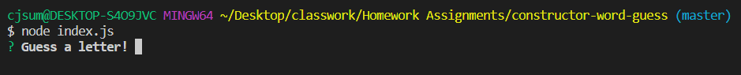
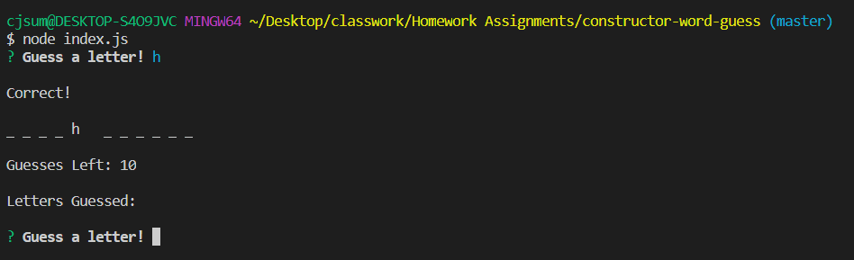
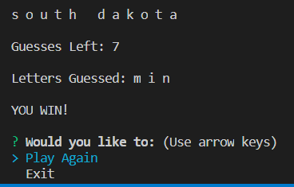

# Constructor Word Guess
https://cjsummers003.github.io/constructor-word-guess/

<h2>Description</h2>
This is a hangman-type word guessing game. It is run entirely in the Nodejs command line using inquirer, constructors, and modules.
 
<h2>Installation Directions</h2>
To start the game you need to install the "inquirer" npm package.  Simply type in the command line "npm install".  Make sure you are in the same folder as the cloned files.
 
<h2>Example of the game</h2>
* type node index.js in the command line and you will be prompted to enter a letter.  
 
* HINT! This game is based on the United States
 

 
 
* If you guess correctly it will let you know you are correct and insert the letter in the correct location(s) in the selected word.
 
* The words will be randomly selected each time the game is played.
 
* It will also tell you how many guess you have left and only subtracts when your guess is incorrect.

 
 
* If you succesfully guess the correct word(s) you will be notified you have won.
 
* If you couldn't guess the word(s) no worries you can choose to play again.

 
 
<h2>Technology Used</h2>
* inquirer npm package
 
* Node.js
 
 
<h2>Author</h2>
* CJ Summers
